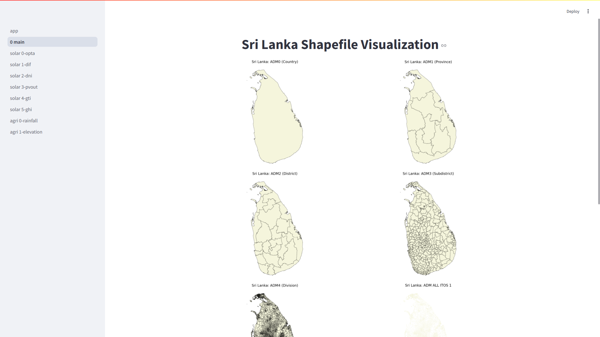
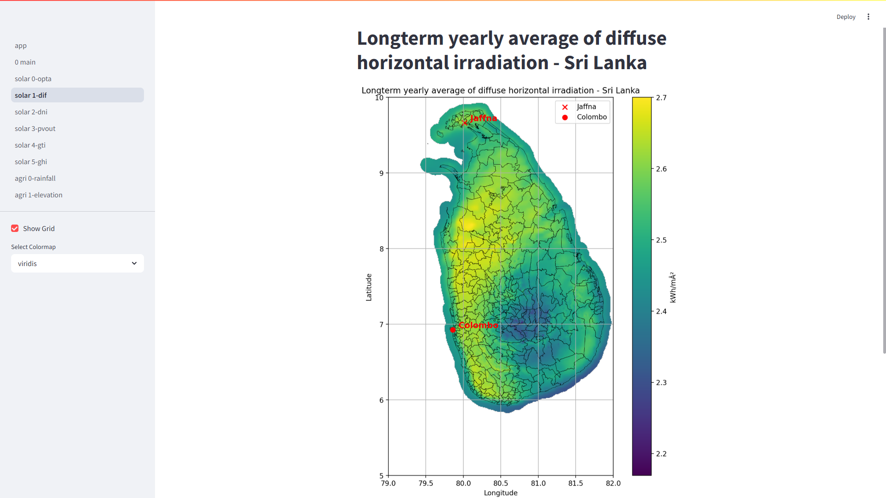

# AgroPlan-m

AgroPlan-m is a project designed to provide agricultural and solar data insights for Sri Lanka. The repository includes configurations for geospatial data, shapefiles, and colormaps.

## Prototype 1 

Screenshot 1

Screenshot 2 

## Repository Structure

- **pages/config.py**: Contains configuration paths for solar data, agricultural data, and shapefiles.
- **data/**: Directory containing datasets for solar and agricultural data.
  - **solar/solargis/**: Contains geotiff files for solar data.
  - **agri/**: Contains CSV files for agricultural data (e.g., rainfall data).
  - **lk_shp/**: Contains shapefiles for Sri Lanka's administrative boundaries.

## Key Configurations

### Solar Data

The `config.py` file defines paths for solar data geotiff files:

- **Daily Sum Geotiff Files**:
  - `opta`: Path to the OPTA geotiff file.
  - `dif`: Path to the DIF geotiff file.

### Agricultural Data

- **Rainfall Data**: The rainfall data is stored in `data/agri/rainfall_lk.csv`.

### Shapefiles

The repository includes shapefiles for Sri Lanka's administrative boundaries:

- `lk_adm0_shp_path`: Country-level shapefile.
- `lk_adm1_shp_path`: Province-level shapefile.
- `lk_adm2_shp_path`: District-level shapefile.
- `lk_adm3_shp_path`: Subdistrict-level shapefile.
- `lk_adm4_shp_path`: Division-level shapefile.

### Colormaps

The following colormaps are supported:
- `viridis`
- `plasma`
- `inferno`
- `magma`
- `cividis`

## License

This project is licensed under [Your License Here].

## EcoNova 

